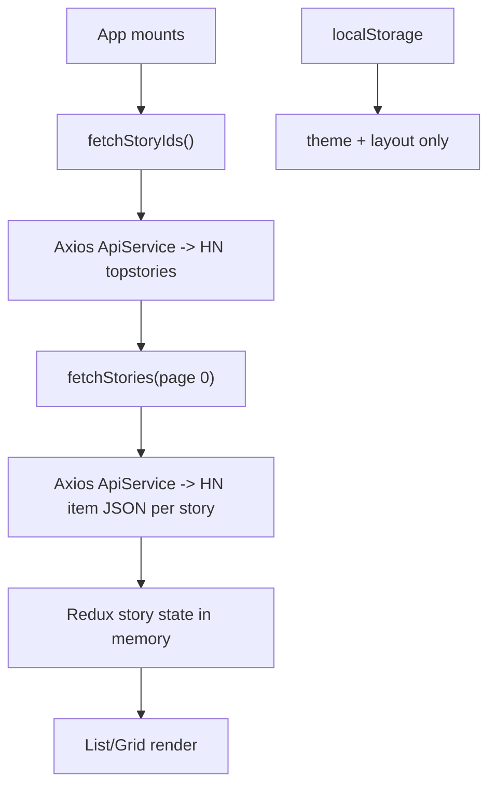
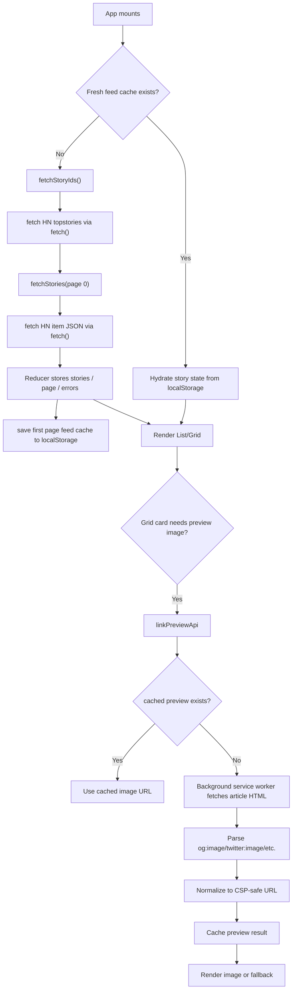

# Hacker News Reader Fork Report

> Comprehensive comparison of the current fork workspace at `reztag/hacker-news-reader` against `gitconnected/hacker-news-reader` (`upstream/master`).
>
> Comparison basis:
> - Upstream base: `upstream/master` at commit `47bcfbbd4721228df06ee5c0e3c51587c25ac28d`
> - Fork HEAD: `ef9a94f2caabbc1b5b16554cd5ee2d643d037c9e`
> - Also includes **current uncommitted workspace changes** present at the time of writing
>
> Date: `2026-04-07`

---

## Table of Contents

1. [Executive Summary](#executive-summary)
2. [Methodology and Scope](#methodology-and-scope)
3. [At-a-Glance Change Matrix](#at-a-glance-change-matrix)
4. [Product and Runtime Repositioning](#product-and-runtime-repositioning)
5. [Tooling and Tech Stack Changes](#tooling-and-tech-stack-changes)
6. [Architecture: How the Original Worked vs How the Fork Works](#architecture-how-the-original-worked-vs-how-the-fork-works)
7. [Extension Packaging and Browser Integration Changes](#extension-packaging-and-browser-integration-changes)
8. [Feed Fetching, Refresh, Pagination, and Caching Changes](#feed-fetching-refresh-pagination-and-caching-changes)
9. [Preview Image Pipeline and Fallback Image Changes](#preview-image-pipeline-and-fallback-image-changes)
10. [UI, Branding, and Interaction Changes](#ui-branding-and-interaction-changes)
11. [State Management and Storage Changes](#state-management-and-storage-changes)
12. [Testing Modernization](#testing-modernization)
13. [Documentation and Repository Cleanup](#documentation-and-repository-cleanup)
14. [Current Workspace-Only Additions Not Yet in HEAD](#current-workspace-only-additions-not-yet-in-head)
15. [Commit History Summary](#commit-history-summary)
16. [Key File Inventory](#key-file-inventory)
17. [How the Extension Works Today](#how-the-extension-works-today)
18. [Final Assessment](#final-assessment)

---

## Executive Summary

This fork is no longer just a small theme or branding variation of the original project. It has evolved from an older **Create React App + React 16 + tutorial/PWA-style sample** into a more practical **Manifest V3 Chromium new-tab extension** built on **React 18 + Vite + Vitest**.

The most important changes are:

- The build system moved from **Create React App** to **Vite**.
- The runtime moved from a mixed web-app/PWA tutorial structure to a **real Chrome extension manifest** with a **Manifest V3 background service worker**.
- The networking layer moved from a generic **Axios ApiService** to direct **`fetch()`** usage.
- The story feed gained **stateful caching** in local storage.
- Story refresh behavior became more correct: **refresh replaces stale page-0 data instead of appending duplicates**.
- The extension now has a **preview image pipeline** that fetches article HTML, extracts preview metadata, caches results, and normalizes image URLs to satisfy extension security rules.
- The old hardcoded remote Miro fallback image is now **bundled locally**, which removes a brittle external runtime dependency.
- The app UI was modernized and de-branded from `gitconnected` in the visible runtime UI.
- The test stack moved from **Enzyme** to **Testing Library + Vitest**, with more behavior-oriented tests around caching, errors, and reducer logic.

One thing that did **not** change:

- There is still **no backend and no database**. The extension remains a purely client-side app that reads Hacker News story data, target article HTML for previews, and browser local storage.

---

## Methodology and Scope

This report was produced by comparing the current workspace against the original upstream repository at `upstream/master`.

Sources used for the comparison:

- `git log upstream/master..HEAD`
- `git diff upstream/master`
- direct inspection of current source files in the fork workspace
- inspection of upstream versions of the same files through `git show upstream/master:<path>`

### Important note about scope

This report covers **both**:

1. changes already committed on the fork branch, and
2. additional local workspace changes that are currently present but not yet committed

That matters because some of the newest behavior, especially around fallback images, exists in the working tree and should still be documented as part of the current fork state.

---

## At-a-Glance Change Matrix

| Area | Original Upstream | Current Fork / Workspace |
| --- | --- | --- |
| Primary packaging model | CRA-style web app with extension-adjacent tutorial framing | Actual Chromium extension project centered on MV3 |
| Build tool | `react-scripts` | `vite` |
| React version | 16.7 | 18.3 |
| Test runner | Jest via CRA + Enzyme | Vitest + Testing Library + JSDOM |
| API client | Axios via `ApiService` | native `fetch()` |
| PWA/service worker | CRA service worker present | removed |
| Browser extension manifest | only PWA `public/manifest.json` | root `manifest.json` for MV3 |
| Background worker | none | `extension-background.js` service worker |
| Feed cache | none | localStorage feed cache with 1-hour TTL |
| Preview image system | none | metadata parsing + cache + CSP-safe normalization |
| Fallback thumbnail | remote Miro image URL | bundled local copy of that image |
| Special social fallback | none | current workspace has local X/Twitter thumbnail handling |
| Initial load behavior | fetch on mount every new tab | hydrate from cache when fresh; fetch otherwise |
| Refresh semantics | page-0 refresh could effectively re-append through existing flow | refresh resets state and replaces page-0 stories |
| Error handling | relatively coarse | separate initial-load error and later-page error |
| Branding | `gitconnected` visible in nav and social links | visible runtime branding largely removed |

---

## Product and Runtime Repositioning

The original repository presented itself as a tutorial project, a coding-course companion, a web app that could also be packaged as an extension, and a branded `gitconnected` experience.

The fork repositions the project toward a standalone Hacker News reader extension, a Chromium new-tab replacement, a more product-like runtime, and a less tutorial-centric and less third-party-branded user experience.

The original repo was still carrying a lot of tutorial-era structure:

- tutorial documents
- CRA service worker files
- web-app-style `public/manifest.json`
- README content focused on learning React/Redux rather than shipping an extension

The fork strips that down and focuses the repo on the extension itself.

---

## Tooling and Tech Stack Changes

### Frontend runtime libraries

| Package area | Original | Fork |
| --- | --- | --- |
| React | `react@16.7.0` | `react@18.3.1` |
| React DOM | `react-dom@16.7.0` | `react-dom@18.3.1` |
| Styled Components | `4.1.3` | `6.1.12` |
| React Redux | `6.0.0` | `9.1.2` |
| Redux | `4.0.1` | `5.0.1` |
| Redux Thunk | `2.3.0` | `3.1.0` |
| Reselect | `4.0.0` | `5.1.1` |
| React Infinite Scroll | `4.2.0` | `6.1.0` |
| React Timeago | `4.1.9` | `7.2.0` |

### Build and test stack

| Concern | Original | Fork |
| --- | --- | --- |
| Build tool | Create React App | Vite |
| React build adapter | implicit CRA Babel pipeline | `@vitejs/plugin-react` |
| Test runner | CRA test command | `vitest run` |
| DOM test env | CRA/JSDOM | `jsdom` via Vitest |
| UI testing | Enzyme | Testing Library |
| Assertions | default Jest matchers | `@testing-library/jest-dom/vitest` |

### Removed packages / patterns

The fork removes several older tutorial-era dependencies:

- `axios`
- `enzyme`
- `enzyme-adapter-react-16`
- `react-test-renderer`
- `react-scripts`
- `redux-logger`
- Node `url` package

These removals simplify the app and reduce historical baggage. No generic API abstraction layer is needed for a small extension hitting a single JSON API, no CRA-specific plumbing is needed once Vite takes over, and no Node polyfill package is needed when browsers already have the standard `URL` API.

### Database / backend changes

There are **no database changes** because there is **no database in either version**. There is also **no backend introduced in the fork**. The project remains client-side only, Redux-managed in memory, persisted partially via browser local storage, and network-backed by external services only.

---

## Architecture: How the Original Worked vs How the Fork Works

### Original architecture



Characteristics of the original architecture:

- class-based `App`
- `connect()` container for `App` and `Nav`
- `axios` through a shared `ApiService`
- CRA rendering entrypoint
- CRA service worker registration
- only `theme` and `layout` persisted
- no preview-fetch subsystem
- no real extension background worker

### Current fork architecture



The fork is more browser-native: `fetch()` instead of Axios, `URL` instead of Node `url`, React hooks instead of most `connect()` wrappers and class lifecycle methods, local storage used for both preferences and data caching, and a background service worker used for HTML preview fetching in extension context.

---

## Extension Packaging and Browser Integration Changes

### 1. Real extension manifest added

The original repo did **not** have a root-level Chrome extension manifest suitable for an MV3 extension. It had a `public/manifest.json`, but that file was a web-app/PWA manifest, not a Chrome extension manifest.

The fork adds a real extension manifest at the repo root:

```json
{
  "manifest_version": 3,
  "chrome_url_overrides": {
    "newtab": "dist/index.html"
  },
  "background": {
    "service_worker": "extension-background.js"
  }
}
```

This changes the packaging model completely:

- the extension now overrides the browser new-tab page using `chrome_url_overrides`
- the built Vite app lives under `dist/index.html`
- a background service worker exists as part of the extension runtime

### 2. CRA service worker removed

Original repo:

- included `src/registerServiceWorker.js`
- registered it from `src/index.js`
- carried typical CRA offline/PWA behavior

Fork:

- removes `registerServiceWorker.js`
- removes the registration call
- no longer behaves like a generic PWA with CRA cache-first mechanics

This is an architectural cleanup: fewer stale-build issues from CRA service worker caching, a clearer extension packaging story, and less confusion between "website" and "extension".

### 3. Background service worker introduced

The fork adds `extension-background.js`, which listens for a message of type `FETCH_PREVIEW_HTML` and fetches the target page HTML.

That creates a separation of responsibilities:

- UI thread requests preview HTML
- extension service worker performs the fetch
- preview parser extracts image metadata in the page context

### 4. Extension permissions and CSP are now explicit

The fork’s `manifest.json` includes:

- `host_permissions` for `<all_urls>` and Hacker News API
- an explicit `content_security_policy` for extension pages

Current CSP:

```text
script-src 'self'; object-src 'self'; img-src 'self' data: https:; connect-src 'self' https:;
```

**CSP** stands for **Content Security Policy**. It is a browser-enforced security policy that tells the extension page what scripts it may run, what URLs it may connect to, what kinds of images it may load, and what protocols are allowed.

That matters because the extension is a Chrome new-tab page. If a preview parser returns an `http:` image URL, a strange custom scheme, or a malformed URL, the browser can block it under CSP. The fork explicitly adapts to that instead of ignoring it.

---

## Feed Fetching, Refresh, Pagination, and Caching Changes

### 1. Original feed behavior

The original repo had:

- no feed cache
- no timed refresh loop
- no persistent story data across new tabs/browser launches

Behaviorally, that meant:

- opening a new tab mounted `App`
- `componentDidMount()` called `fetchStoriesFirstPage()`
- that dispatched `fetchStoryIds()`
- then page 0 was fetched

So the original refresh model was:

> **refresh only on mount**, not on a timer

It did **not** auto-refresh every X minutes in the background.

### 2. Current feed refresh model

The current fork still does **not** poll Hacker News on a repeated interval. There is **no automatic background refresh timer** and no recurring "every 30s/every 5m" polling loop.

Instead, the fork uses a **cache freshness window**:

- feed cache TTL: **1 hour**

Current behavior in plain English:

- if the app starts and the saved feed cache is **less than 1 hour old**, it reuses the cached first page immediately
- if the cache is **older than 1 hour**, the app discards it and fetches fresh data from Hacker News
- if the user manually refreshes via the refresh flow, that **bypasses cache**

So the effective refresh policy is:

| Situation | Behavior |
| --- | --- |
| New tab opened within 1 hour of last fetch | reuse cached first page |
| New tab opened after 1 hour | fetch fresh top stories |
| Manual refresh | force network refresh |
| Infinite scroll for later pages | fetch on demand |

### 3. Feed cache implementation

The fork adds:

- `src/store/middleware/localStorageMiddleware/feedCache.js`
- `src/store/story/cacheState.js`
- `loadInitialState()` support for hydrating `state.story`

Stored feed data now includes:

- `storyIds`
- first page `stories`
- `page`
- `fetchedAt`

Storage key:

```text
@@hackerNewsReader/storage/feed
```

### 4. Refresh semantics were corrected

Original logic flowed like this:

```js
fetchStoryIds() -> store new storyIds -> fetchStories(page 0)
FETCH_STORIES_SUCCESS -> append stories to existing state
```

That meant a hard refresh could conceptually reuse the same append-oriented success path, which is not ideal for replacing stale page-0 content.

The fork changes this logic:

- `FETCH_STORY_IDS_REQUEST` resets story state
- `FETCH_STORY_IDS_SUCCESS` stores only the new ID list
- `FETCH_STORIES_SUCCESS`:
  - replaces stories when `page === 0`
  - appends stories when `page > 0`

Result:

- initial load is clean
- refresh is clean
- infinite scroll still appends
- page-0 no longer behaves like a "load more" event

### 5. Duplicate prevention added

The reducer now deduplicates story arrays by `story.id`.

This is a defensive improvement because:

- story order can shift between requests
- page boundaries can overlap during rapid changes
- duplicate items are a visible UX bug

### 6. Error handling is more granular

Original story state had:

- `storyIds`
- `stories`
- `page`
- `isFetching`
- `error`

The fork adds `pageError`, creating two error layers:

| Error type | Meaning |
| --- | --- |
| `error` | initial load / feed-level failure |
| `pageError` | later pagination failure while existing stories remain visible |

This is a meaningful UX improvement because a failed "load more" request no longer needs to behave like a total app failure.

### 7. Hacker News API layer was modernized

Original:

- generic `ApiService`
- `axios`
- `topstories.json?print=pretty`

Fork:

- direct `fetch()`
- simpler `getJson()` helper
- `Promise.allSettled()` for story fetch batches
- invalid or malformed story payloads filtered out

This makes the story fetcher smaller, less dependent on general-purpose infrastructure, and more tolerant of partial failure.

---

## Preview Image Pipeline and Fallback Image Changes

### 1. Original behavior: no preview pipeline

In the original repo, grid cards always rendered the same hardcoded remote image:

```text
https://miro.medium.com/max/1176/1*F9RzuXseG1VrTjFJd403gw.png
```

That means:

- there was no attempt to extract per-article preview images
- every grid card used the same fallback image
- the fallback itself depended on a third-party remote host

### 2. Fork behavior: preview extraction system added

The fork introduces `src/services/linkPreviewApi.js`.

It does all of the following:

- fetches target article HTML
- parses the document with `DOMParser`
- searches for common image metadata
- falls back to `article img`, `main img`, or first `img`
- normalizes the discovered URL
- caches the result in local storage
- deduplicates concurrent requests for the same article URL

Metadata selectors used include:

- `og:image:secure_url`
- `og:image`
- `og:image:url`
- `twitter:image`
- `twitter:image:src`
- `itemprop="image"`
- `link[rel="image_src"]`

### 3. Preview cache behavior

Storage key:

```text
@@hackerNewsReader/storage/previewCache
```

Current preview cache TTL:

- **1 hour**

This means:

- repeated visits to the same article within 1 hour reuse the saved preview result
- a cached miss is also remembered, so the app does not repeatedly refetch hopeless pages
- expired preview entries are removed and re-fetched on next access

### 4. CSP-safe preview URL normalization

The fork adds explicit URL normalization for preview images.

Rules implemented:

- invalid URLs become empty strings
- `http:` URLs are upgraded to `https:`
- only `https:` and `data:` are accepted
- invalid cached entries are scrubbed from storage

Without this, preview extraction could return something like:

```text
http://example.com/image.png
```

but the extension CSP says:

```text
img-src 'self' data: https:
```

That means plain `http:` images are blocked. So the fork does not just "load whatever URL it finds." It adapts preview URLs so they are consistent with the extension’s security policy.

### 5. Preview fetch path adapts to extension runtime

`linkPreviewApi` can work in two modes:

| Environment | Fetch path |
| --- | --- |
| Extension runtime available | message background service worker and fetch HTML there |
| Normal browser/test environment | fetch directly in page context |

This is a useful architectural change because preview extraction is no longer tightly coupled to one runtime assumption.

### 6. Generic fallback image changed from remote to bundled local asset

The original repo used a remote Miro-hosted image as the fallback thumbnail.

The current fork now uses a bundled local copy of that same fallback image:

- file: `public/fallback-thumbnail.png`

Current `GridItem` comment in code explicitly documents that this is a locally bundled copy of the original Miro fallback image.

This removes several weaknesses from the old approach:

- no dependency on a third-party host being up
- no dependency on that URL staying valid forever
- no external fetch for the default card state
- fewer CSP/network surprises

### 7. Current workspace also adds X/Twitter-specific local fallback handling

In the current workspace state, `GridItem` also has a special-case fallback for:

- `x.com`
- `twitter.com`
- subdomains of those hosts

Behavior:

- if the article link resolves to X/Twitter, the card uses a local `x-thumbnail.png`
- for those links, preview fetching is skipped
- image errors keep the X thumbnail in place

This logic is **not** part of upstream and **is** part of the current workspace delta.

---

## UI, Branding, and Interaction Changes

### 1. Visible branding changes

The original UI prominently showed:

- `gitconnected` in the top-left nav
- a `(build your own)` link under the title
- social links for Twitter, Slack, Medium, Facebook, and Site

The current runtime UI removes those visible elements and re-centers the extension on `// Hacker News Reader` itself.

### 2. Navigation redesign

Original nav:

- compact bar
- external `gitconnected` logo link
- icon-only layout toggle
- icon-only theme toggle

Current nav:

- title moved into the top bar
- larger branded title text
- pill/button-like controls
- icons placed to the left of text labels
- explicit labels: `Grid`/`List`, `Dark`/`Light`, and `About`

Text-labeled controls reduce ambiguity compared with icon-only controls, especially in a new-tab extension where people may interact quickly and repeatedly.

### 3. App shell and loading states

Original app:

- mounted the nav and the story list/grid
- did not expose strong initial loading or retry UX

Current app:

- renders explicit loading state cards
- renders explicit initial error state with retry button
- renders explicit pagination error state with retry button
- keeps already-loaded stories visible during later-page failures

That is a real behavior improvement, not just a styling change.

### 4. Grid card behavior changed significantly

Original grid cards:

- fixed remote fallback image
- title
- site name only

Current grid cards:

- preview image support
- local fallback support
- lazy-loaded images
- alt text
- footer layout
- Hacker News comment link
- visible comment count
- custom SVG comment icon

### 5. List view

List view logic is mostly preserved functionally. The biggest changes around stories are concentrated in the app shell, fetch/caching behavior, and grid card media behavior. The list item component itself is largely the same aside from migration to `.jsx` naming.

---

## State Management and Storage Changes

### 1. Hook-based Redux usage

Original app structure used classic `connect()` containers for both `App` and `Nav`.

Current fork:

- `App` uses `useDispatch()` and `useSelector()`
- `Nav` wrapper uses hooks instead of `connect()`

This makes component data dependencies more local and easier to trace in component files.

### 2. Redux middleware changed

Original middleware stack:

- `redux-thunk`
- local-storage middleware
- `redux-logger` in non-production

Current middleware stack:

- `redux-thunk`
- local-storage middleware
- Redux DevTools compose integration via `window.__REDUX_DEVTOOLS_EXTENSION_COMPOSE__`

Impact:

- less console noise from logger middleware
- more modern devtools-friendly integration

### 3. Persisted state grew from preferences-only to preferences-plus-feed

Original local storage persistence:

- `@@hackerNewsReader/storage/theme`
- `@@hackerNewsReader/storage/layout`

Current local storage persistence adds:

- `@@hackerNewsReader/storage/feed`
- `@@hackerNewsReader/storage/previewCache`

Storage model today:

| Key | Purpose |
| --- | --- |
| `@@hackerNewsReader/storage/theme` | persisted dark/light mode |
| `@@hackerNewsReader/storage/layout` | persisted list/grid choice |
| `@@hackerNewsReader/storage/feed` | cached first page of feed with freshness timestamp |
| `@@hackerNewsReader/storage/previewCache` | cached preview image results and misses |

### 4. Initial state hydration changed materially

Original `loadInitialState()` loaded theme and layout.

Current `loadInitialState()`:

- loads theme
- loads layout
- tries to load a fresh feed cache
- if valid, builds a `story` slice up front

This changes startup behavior from "always cold boot the feed" to "warm boot the feed when recent data already exists".

---

## Testing Modernization

### 1. Test philosophy changed

Original:

- Enzyme shallow rendering
- snapshot-style tests
- older React 16 testing patterns

Fork:

- Testing Library
- user-visible assertions
- reducer and action behavior tests
- localStorage/cache tests
- runtime safety tests

### 2. Setup file changed

Original `src/setupTests.js` configured Enzyme with the React 16 adapter.

Current `src/setupTests.js` imports `@testing-library/jest-dom/vitest`.

### 3. New behavioral tests added

Examples of newly covered areas:

- app initial load success
- app initial load retry after failure
- page-level retry after later-page error
- feed cache hydration
- feed cache expiry
- manual refresh bypassing cache
- story reducer refresh replacement behavior
- story deduplication behavior
- preview image cache hits
- preview image cache misses
- preview cache expiry
- preview URL normalization from `http:` to `https:`
- localStorage availability failure handling

### 4. Spec shim pattern introduced

Vitest is configured to include `src/**/*.spec.js`, while several actual tests are written as `*.test.js`. To bridge that, the current workspace includes small `.spec.js` shim files that import the matching `.test.js` files.

Examples:

- `src/services/linkPreviewApi.spec.js` imports `src/services/linkPreviewApi.test.js`
- `src/store/story/actions.spec.js` imports `src/store/story/actions.test.js`
- `src/store/story/reducer.spec.js` imports `src/store/story/reducer.test.js`

That is a testing-architecture detail worth documenting because it affects how test discovery works in the fork.

---

## Documentation and Repository Cleanup

### 1. README rewritten

Original README focused on tutorials, coding courses, step-by-step learning, community links, demo media, and "build your own" framing.

Current README focuses on what the extension is, current features, tech stack summary, and how to install it as a Chromium extension.

### 2. Tutorial content removed

Deleted from the fork:

- `tutorial/TUTORIAL.md`
- `tutorial/meta.json`

This strongly reinforces the repo’s shift away from tutorial packaging.

### 3. Demo/screenshot assets removed

Deleted assets include:

- `public/hacktoberfest-react.png`
- `public/hacktoberfest-screenshot.png`

### 4. `.gitignore` updated

The fork adds:

```text
/dist
```

This is consistent with the shift from CRA build output (`/build`) to Vite build output (`/dist`).

### 5. Remaining legacy metadata

One leftover upstream detail still present in the current workspace is the HTML document title in `index.html`:

```html
<title>Hacker News Reader by gitconnected</title>
```

So although the visible runtime UI has been largely de-branded, some page metadata still contains the upstream brand string.

---

## Current Workspace-Only Additions Not Yet in HEAD

These files are present in the workspace and differ from upstream even though some are not yet committed on the branch:

### Untracked assets

- `public/fallback-thumbnail.png`
- `public/x-thumbnail.png`

### Untracked helpers

- `src/store/middleware/localStorageMiddleware/feedCache.js`
- `src/store/story/cacheState.js`

### Untracked tests and test shims

- `src/components/GridItem/GridItem.spec.js`
- `src/services/linkPreviewApi.spec.js`
- `src/store/middleware/localStorageMiddleware/loadInitialState.spec.js`
- `src/store/middleware/localStorageMiddleware/loadInitialState.test.js`
- `src/store/story/actions.spec.js`
- `src/store/story/actions.test.js`
- `src/store/story/reducer.spec.js`
- `src/store/story/reducer.test.js`

Anyone reviewing only the branch commit history may miss these workspace-level additions. Since the request for this report was to capture **all current changes**, they are included here intentionally.

---

## Commit History Summary

Commits on the fork branch ahead of `upstream/master`:

| Commit | Message | Broad meaning |
| --- | --- | --- |
| `5babc3a` | `Modernize the app and restore news loading` | major modernization foundation |
| `a8149b3` | `Complete rewrite to update to manifest v3 with direct link to see the HN post functionality` | extension/runtime overhaul |
| `588da7d` | `Updated README.md` | docs refresh |
| `ba62133` | `Revise README description for Hacker News reader` | docs refinement |
| `0f1fea9` | `removed PWA ability and cleaned some codebase` | removed CRA/PWA leftovers |
| `6cf4881` | `Merge branch 'master' of https://github.com/reztag/hacker-news-reader` | branch sync merge |
| `ef9a94f` | `Remove web app instructions from README.md` | docs focused further on extension use |

The large product-level theme across these commits is:

> modernize the stack, re-center the project as an extension, and clean out tutorial-era/web-app-era structure

---

## Key File Inventory

### Build / packaging / browser runtime

| File | Change |
| --- | --- |
| `package.json` | moved from CRA/Enzyme/Axios stack to Vite/Vitest/native fetch-oriented stack |
| `vite.config.js` | new Vite config with React plugin, aliasing, and test configuration |
| `manifest.json` | new root MV3 extension manifest |
| `extension-background.js` | new background service worker for preview HTML fetch |
| `index.html` | new Vite entry HTML |
| `src/registerServiceWorker.js` | removed |
| `public/manifest.json` | removed PWA manifest |

### App shell / UI

| File | Change |
| --- | --- |
| `src/components/App/App.js` | removed class-based component |
| `src/components/App/App.jsx` | new hook-based app shell |
| `src/components/App/styles.js` | title/social layout removed; loading/error state styles added |
| `src/components/Nav/Nav.js` | removed old icon-only branded nav |
| `src/components/Nav/Nav.jsx` | new text-labeled control nav |
| `src/components/Nav/styles.js` | redesigned nav layout and control styling |

### Feed / state / caching

| File | Change |
| --- | --- |
| `src/store/story/actions.js` | async action modernization and stronger error handling |
| `src/store/story/reducer.js` | refresh reset, page replacement, dedupe, separate page error |
| `src/store/story/selectors.js` | new `storyStatusSelector` |
| `src/store/middleware/index.js` | logger removed, DevTools compose used |
| `src/store/middleware/localStorageMiddleware/loadInitialState.js` | can hydrate story cache |
| `src/store/middleware/localStorageMiddleware/saveState.js` | can delete storage keys on `undefined` |
| `src/store/middleware/localStorageMiddleware/storageDefinitions.js` | persists feed cache and clears it on refresh |
| `src/store/middleware/localStorageMiddleware/feedCache.js` | new feed cache helper |
| `src/store/story/cacheState.js` | new story-state hydrator |

### Data / networking / parsing

| File | Change |
| --- | --- |
| `src/services/Api.js` | removed generic Axios wrapper |
| `src/services/hackerNewsApi.js` | now uses native fetch and filters fulfilled/valid stories |
| `src/services/linkPreviewApi.js` | new preview extraction/cache/CSP-normalization subsystem |
| `src/utils/getSiteHostname.js` | moved from Node `url` parsing to native `URL` |

### Story card / presentation

| File | Change |
| --- | --- |
| `src/components/GridItem/index.jsx` | preview images, local fallback, X/Twitter fallback path, comments footer |
| `src/components/GridItem/styles.js` | media/footer styling updates |
| `public/fallback-thumbnail.png` | bundled local generic fallback image |
| `public/x-thumbnail.png` | bundled local X/Twitter fallback image in current workspace |

### Tests

| File | Change |
| --- | --- |
| `src/setupTests.js` | Enzyme removed; Testing Library matcher setup added |
| `src/components/App/App.spec.js` | app behavior test coverage |
| `src/services/linkPreviewApi.test.js` | preview cache/normalization tests |
| `src/components/GridItem/GridItem.spec.js` | X/Twitter fallback behavior tests |
| `src/store/story/actions.test.js` | refresh bypass test |
| `src/store/story/reducer.test.js` | refresh/append/dedupe tests |
| `src/store/middleware/localStorageMiddleware/loadInitialState.test.js` | feed hydration/expiry tests |
| `src/utils/browser.spec.js` | utility coverage |

---

## How the Extension Works Today

### Startup flow

1. The extension opens a new tab using `chrome_url_overrides`.
2. `dist/index.html` loads the Vite-built app.
3. `src/index.jsx` creates a React 18 root and initializes Redux.
4. `loadInitialState()` checks local storage for theme, layout, and feed cache.
5. If a fresh feed cache exists, the first page renders immediately.
6. If not, `App` dispatches `fetchStoryIds()`.
7. Story IDs are fetched from Hacker News.
8. Page 0 stories are fetched from Hacker News.
9. The first page is saved back into the feed cache.

### Feed browsing flow

1. Infinite scroll calls `fetchStories({ storyIds, page })`.
2. The app fetches the next 20 story IDs worth of item payloads.
3. Later pages append to the story list.
4. Duplicate story IDs are filtered out.
5. If a later page fails, `pageError` is shown but existing content stays visible.

### Grid image flow

1. Grid card starts with local fallback image.
2. If link is currently treated as X/Twitter, local X thumbnail is used and preview fetch is skipped.
3. Otherwise `linkPreviewApi.getPreviewImage(link)` runs.
4. The preview cache is checked first.
5. If there is no fresh cached result:
   - HTML is fetched directly or through extension messaging
   - metadata is parsed
   - candidate image URL is normalized to CSP-safe form
   - the result is cached
6. If the preview image loads, it is shown.
7. If not, the card falls back to its local bundled image.

---

## Final Assessment

The fork meaningfully improves the original repository in three broad ways:

### 1. It is more deployable as a real extension

The move to Manifest V3, a root extension manifest, a background service worker, and Vite build output makes the repo feel like a maintained extension codebase instead of a tutorial project that also happens to be extension-compatible.

### 2. It is more robust in day-to-day use

The practical end-user improvements are substantial:

- fewer unnecessary network requests
- faster warm starts via feed caching
- better handling of preview images
- safer image loading under extension CSP
- less broken behavior on paginated fetch failures
- local fallback image instead of remote dependency

### 3. It is more maintainable technically

The fork replaces older patterns with simpler, more direct ones:

- React hooks over older class/container composition
- native browser APIs over compatibility/polyfill packages
- Vite over CRA
- behavior-oriented tests over Enzyme shallow rendering

### Overall conclusion

Compared with the original `gitconnected/hacker-news-reader`, this fork is best understood as a modernization and productization pass that turns a tutorial-era React/Redux Hacker News reader into a more practical MV3 browser extension, with better startup behavior, safer preview handling, cleaner runtime UX, and a more current frontend toolchain.

---

## Appendix: Concise “What Changed?” Summary

If someone wants the shortest technically accurate version:

- The repo moved from **CRA + React 16 + Axios + Enzyme** to **Vite + React 18 + fetch + Vitest/Testing Library**.
- The project shifted from a tutorial/PWA structure to a proper **Manifest V3 Chrome new-tab extension**.
- The app now caches the feed and preview images in local storage.
- Feed cache TTL is **1 hour**.
- Preview cache TTL is **1 hour**.
- There is still **no auto-polling refresh timer**.
- The original remote Miro fallback image was replaced with a **bundled local copy**.
- The fork added a **preview image extraction system** and made preview URLs **CSP-safe**.
- UI branding was cleaned up to remove most visible `gitconnected` references.
- The current workspace also contains **special local X/Twitter thumbnail handling**.
